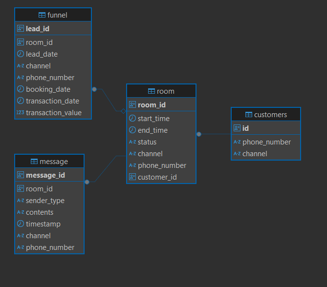

# Case_Study

💬 Sparks Sports Academy - Message Ingestion

This is a technical use case project developed with FastAPI as part of a technical recruitment challenge. Designed to handle message ingestion and integrate with Google Sheets and a PostgreSQL database

## Note
- This project requires gspread-creds generated from googleapis to actually work
- For the sake confidential data reasons, that creds is not included.
- This Readme aims to give understanding of how this project should be run and what will be achieved.

➡️ Diagram

This case study aims to build a message ingestion system that can:
- Ingest messages from spreadsheet (Google Spreadsheet)
- Handle ongoing chat sessions (rooms).
- Parse and extract important info (funnel data).


💻 Table Structure
This set of tables represents a relational schema that supports the Message Ingestion API for Sparks Sports Academy. Here's how each table relates to the others and how they tie into the functionality of this project.

| Feature                     | How It’s Reflected in Schema                                                                 |
|----------------------------|----------------------------------------------------------------------------------------------|
| **Customer management**     | `customers` table keeps track of each user via phone/channel.                               |
| **Room/session handling**   | `room` table logs session start, status, and (with many-to-many support) connects to customers. |
| **Message ingestion**       | `message` table records chat messages and links them to their respective `room`.            |
| **Lead tracking (funnel)**  | `funnel` table logs metadata like booking/transaction details, optionally tied to a room.   |



🛠️ Tech Stack
- Python 3.11+
- FastAPI
- SQLAlchemy
- PostgreSQL
- gspread & oauth2client


## 📦 Features

- Accepts and stores incoming messages.
- Retrieves opening keywords from Google Sheets.
- Creates or updates funnel records based on message content.
- Supports room creation and linking messages to rooms.
- Mandatory fields like booking_date, transaction_date, and transaction_value.

## 🚀 How to Run

1. Clone the Repository
```bash
git clone <your-repo-url>
cd SR_USE_CASE
```
2. Install Dependencies
```bash
pip install -r requirements.txt
```
4. Setup Google Sheets Credentials
```bash
Place your gspread-creds.json in the root of the project (SR_USE_CASE/).
```
3. Start the Server
```bash
uvicorn app.main:app --reload
```
Access the API docs at: 
```bash
http://localhost:8000/docs
```


## 📥 Example Request Bodies
➕ Create a Room
```bash
{
  "room_id": "f3fcadbe-23a6-4013-8b63-123456789abc",
  "start_time": "2025-04-20T10:00:00",
  "channel": "whatsapp",
  "phone_number": "08123456789"
}
```

📨 Ingest a Message
```bash
{
  "phone_number": "08123456789",
  "room_id": "f3fcadbe-23a6-4013-8b63-123456789abc",
  "message": "Hi, I want a trial session!",
  "channel": "whatsapp",
  "sender": "customer",
  "booking_date": "2025-04-21T10:00:00",
  "transaction_date": "2025-04-22T12:00:00",
  "transaction_value": 150000
}
```

## 📂 Project Structure
```bash
SR_USE_CASE/
├── app/
│   ├── __pychache__
│   ├── main.py
│   ├── database.py
│   ├── models.py
│   ├── schemas.py
│   └── keywords.py
├── IMG
│   ├── ERD.png
│   ├── use_case.png
├── ddl.sql
├── requirements.txt
└── README.md
```

